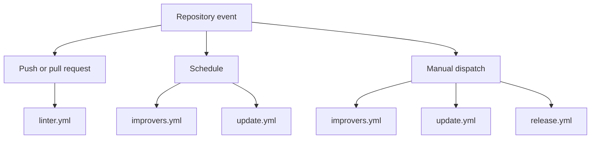

# Available workflows

This directory contains the GitHub Actions workflows currently used by this repository.

## Quick context

- `CI:` [linter.yml](./linter.yml) validates the repository on pushes and pull requests.
- `Maintenance:` [improvers.yml](./improvers.yml) and [update.yml](./update.yml) handle scheduled or manual repository maintenance, quality-driven improvements, and version refreshes.
- `Release:` [release.yml](./release.yml) creates the AI-generated changelog and publishes a GitHub release.

## Execution map

<!-- markdownlint-disable MD013 -->

| Workflow file                    | Purpose                                                                                                                                                                     | Trigger                                 |
| :------------------------------- | :-------------------------------------------------------------------------------------------------------------------------------------------------------------------------- | :-------------------------------------- |
| [linter.yml](./linter.yml)       | Runs repository lint and static analysis checks with `super-linter`, including aggregate failure reporting and AI-assisted diagnosis when validation fails.                 | `push`, `pull_request`, `workflow_call` |
| [improvers.yml](./improvers.yml) | Maintenance workflow that prepares a repository map and runs Copilot-driven improvement tasks for technical debt reduction, ignored rule cleanup, and coverage improvement. | `schedule`, `workflow_dispatch`         |
| [update.yml](./update.yml)       | Scheduled maintenance workflow that refreshes managed version files and opens a pull request with the resulting updates.                                                    | `schedule`, `workflow_dispatch`         |
| [release.yml](./release.yml)     | Produces an AI-generated changelog, pushes changelog/tag updates, and creates a GitHub release from the latest semantic tag.                                                | `workflow_dispatch`                     |

<!-- markdownlint-enable MD013 -->

## Notes

- The repository currently defines four workflow files in this directory.
- The linter workflow is the main validation gate for branch and PR checks.
- The improvers and update workflows are maintenance automation paths triggered on schedule or manual dispatch.
- The release workflow is the manual release path for changelog generation and publishing.
