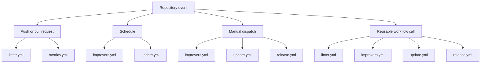

# Available Workflows

This directory contains the reusable GitHub Actions workflows for repository
validation, metrics, maintenance, and releases.

## Choose a workflow

- Use [linter.yml](./linter.yml) to validate a change with Super-Linter.
- Use [metrics.yml](./metrics.yml) to report source lines of code.
- Use [improvers.yml](./improvers.yml) to run scheduled or manual code-quality
  improvement tasks.
- Use [update.yml](./update.yml) to refresh managed dependency versions and
  open a pull request with the changes.
- Use [release.yml](./release.yml) to generate release notes, create semantic
  version tags, and publish a GitHub release.

## Event map

## Workflow reference

| Workflow                         | Responsibilities                                                                                                         | Events                                           |
| :------------------------------- | :----------------------------------------------------------------------------------------------------------------------- | :----------------------------------------------- |
| [linter.yml](./linter.yml)       | Runs Super-Linter validation. On failure, gathers diagnostics and asks the Copilot CLI to file or update a GitHub issue. | `push`, `pull_request`, `workflow_call`          |
| [metrics.yml](./metrics.yml)     | Runs `scc` and reports repository source-line metrics.                                                                   | `push`, `pull_request`                           |
| [improvers.yml](./improvers.yml) | Runs Copilot-driven tasks for technical debt, ignored-rule cleanup, and test coverage.                                   | `schedule`, `workflow_dispatch`, `workflow_call` |
| [update.yml](./update.yml)       | Runs `ci/update_versions.sh` and opens a pull request for managed version changes.                                       | `schedule`, `workflow_dispatch`, `workflow_call` |
| [release.yml](./release.yml)     | Generates an AI-assisted changelog, pushes semantic tags, and creates a GitHub release.                                  | `workflow_dispatch`, `workflow_call`             |

## Schedule

- Scheduled workflows use UTC.
- [improvers.yml](./improvers.yml) runs at `00:00` on the 15th day of each
  month.
- [update.yml](./update.yml) runs at `00:00` every Friday.

You can run both maintenance workflows manually with `workflow_dispatch`.

## Reusable workflow requirements

When another workflow calls these workflows with `workflow_call`, provide the
required secret for the workflow you call:

| Workflow                         | Required secret  | Optional input       |
| :------------------------------- | :--------------- | :------------------- |
| [linter.yml](./linter.yml)       | `COPILOT_TOKEN`  | `validate_overrides` |
| [improvers.yml](./improvers.yml) | `COPILOT_TOKEN`  | None                 |
| [update.yml](./update.yml)       | `WORKFLOW_TOKEN` | None                 |
| [release.yml](./release.yml)     | None             | None                 |

The linter's `validate_overrides` input accepts a JSON object containing
`VALIDATE_*` Super-Linter environment-variable overrides.
