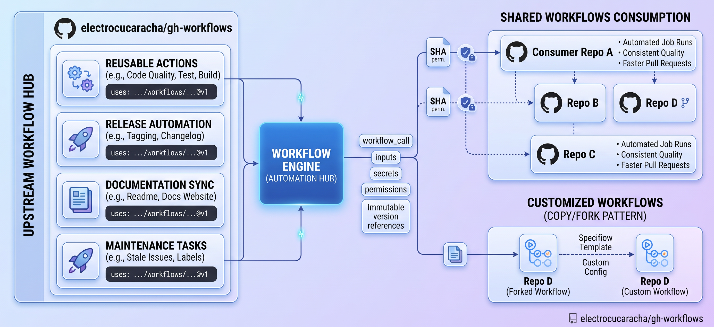

# GitHub Workflows

<!-- markdown-link-check-disable-next-line -->

[](https://opensource.org/licenses/Apache-2.0)
[](https://github.com/marketplace/actions/super-linter)

<!-- markdown-link-check-disable-next-line -->


[](https://github.com/boyter/scc/)
[](https://github.com/boyter/scc/)

## Overview

This repository provides a centralized collection of reusable GitHub Actions workflows
that can be shared and imported across multiple repositories.

Instead of defining the same CI/CD automation independently in every project,
common workflows are maintained in one place and consumed by individual repositories as needed.
The collection covers common development, quality, documentation, release, and maintenance tasks.

Workflows that are designed for reuse can be referenced directly from consuming repositories:

```yaml
jobs:
  shared-workflow:
    uses: electrocucaracha/gh-workflows/.github/workflows/<workflow>.yml@<ref>
```

The `<ref>` can point to a release tag or commit SHA.
Using an immutable reference is recommended when reproducibility and predictable builds are important.

The [workflow catalog](.github/workflows/README.md) provides an overview of the available workflows,
including their purpose and supported triggers.



# Why Use Shared Workflows?

Centralizing GitHub workflows provides several benefits:

- **Reduce duplication** — Define common automation once instead of maintaining similar workflow files across multiple repositories.
- **Improve consistency** — Apply the same development, quality, release, and maintenance practices across projects.
- **Simplify maintenance** — Fix bugs, improve automation, and introduce enhancements in a single shared workflow rather than updating every consuming repository.
- **Increase reusability** — Make proven automation available to any repository that needs it without copying and adapting workflow definitions.
- **Accelerate project setup** — Add standardized CI/CD capabilities to a new repository with a simple workflow reference.
- **Promote best practices** — Establish common patterns for permissions, security, testing, releases, and other automation concerns.
- **Improve governance** — Centralized workflows make it easier to review, standardize, and evolve automation across an organization.
- **Enable controlled adoption** — Repositories can reference a specific release tag or commit SHA, allowing teams to adopt workflow changes at their own pace while maintaining reproducible runs.
- **Reduce operational overhead** — A single source of truth makes workflow ownership and improvements easier to manage over time.

By treating workflows as shared building blocks rather than repository-specific configuration,
this project makes GitHub Actions automation easier to share, standardize, maintain, and evolve.
