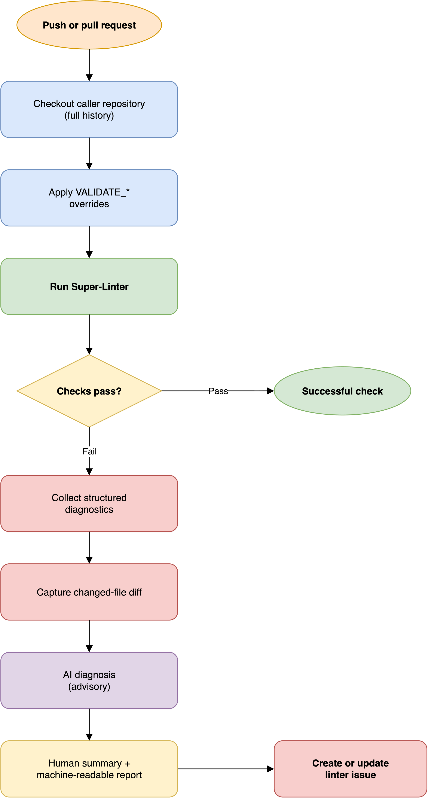

# How the linter workflow works

The linter workflow is the repository's continuous validation path.
It runs Super-Linter against the checked-out caller repository,
using the repository's own configuration files as the source of truth.
The workflow can run directly on pushes and pull requests,
or a caller can invoke its reusable `workflow_call` entry point.

## Validation flow

[Open the editable linter diagram](../assets/linter-workflow.drawio)

The workflow separates validation from diagnosis.
Super-Linter determines whether checks pass.
The later steps preserve the evidence needed to understand a failure
and create a durable record for maintainers.

## Why configuration stays in the caller

The workflow sets `LINTER_RULES_PATH: /`,
so Super-Linter searches the checked-out repository for its configuration.
This allows each repository to keep its formatter rules,
language selection, and exceptions alongside its source code.

The optional `validate_overrides` input changes `VALIDATE_*` environment
variables for one caller.
It is an escape hatch for repository differences,
not a replacement for committed linter configuration.

## Failure evidence has two audiences

When validation fails,
the workflow produces a human summary and a stable machine-readable report.
The human summary is intended for maintainers reading the issue.
The machine report contains the schema version,
failing linter names, affected files, locations, messages, and any AI analysis.

This dual format keeps the issue readable while allowing a coding agent
or later automation to locate the failure without parsing prose.

The changed-file diff gives the diagnosis useful scope.
The linter output remains authoritative;
the AI response is advisory and should be reviewed before anyone applies it.

## Why the workflow creates an issue

The issue is a durable handoff from CI to maintenance work.
It preserves the failure summary after the transient workflow log becomes
harder to find and gives maintainers a place to track the repair.
The `super-linter-issue` label makes these reports discoverable.

The issue action runs only after the job has failed.
Successful validation does not create maintenance noise.

## Permission boundary

The workflow needs `contents: read` to inspect the repository
and `models: read` for the AI-assisted diagnosis.
It needs `issues: write` to publish the failure report.
It does not require a separate secret because the caller's `GITHUB_TOKEN`
is passed to the validation and issue-reporting actions.

## Related documentation

- [Consume the linter workflow](../how-to-guides/consume-linter.md)
- [Linter workflow reference](../references/linter-workflow.md)
- [How the workflows fit together](workflows.md)
