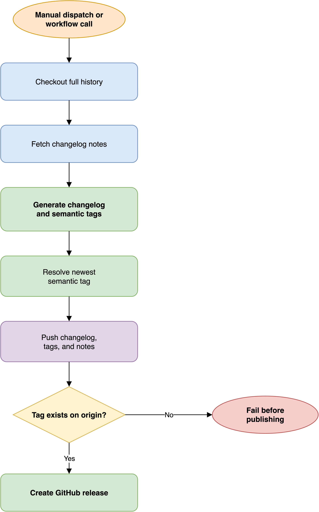

# How the release workflow works

The release workflow converts the current repository state into a GitHub
release.
It generates or updates `CHANGELOG.md`,
creates semantic version tags through the changelog tool,
pushes the release metadata,
and publishes the newest semantic tag as a GitHub release.

## Release flow

[Open the editable release diagram](../assets/release-workflow.drawio)

Full history is required because changelog generation and semantic tag
selection depend on repository history.
The workflow also carries `ai-changelog` notes between runs,
which lets the changelog tool retain its generated context.

## Changelog and release boundaries

The changelog tool determines the semantic version and writes the changelog.
The workflow then selects the newest semantic tag and uses the first three
changelog sections as the release body.
The workflow does not infer a release from a pull request label
or from a separate version input.

This design keeps version calculation in one tool
while leaving publication in the GitHub Actions workflow.

## Publication safety

The workflow pushes the changelog commit and tags before creating the release.
It explicitly verifies that the selected tag is available on the remote.
If that check fails,
the workflow stops before calling `gh release create`.

Tag pushes are partly best effort because a tag may already exist remotely.
The remote verification is the decisive check for publication.

## Permission boundary

The release job has `contents: write` because it updates the changelog,
pushes tags and notes,
and creates a GitHub release.
It uses the caller's `GITHUB_TOKEN` for Git authentication
and for the GitHub CLI release command.

Release is intentionally a manual path.
Unlike validation and maintenance schedules,
it changes the repository's published history and should run only
when the reviewed state is ready to ship.

## Related documentation

- [Workflow catalog](../../.github/workflows/README.md)
- [How the workflows fit together](workflows.md)
- [Release workflow source](https://github.com/electrocucaracha/gh-workflows/blob/main/.github/workflows/release.yml)
