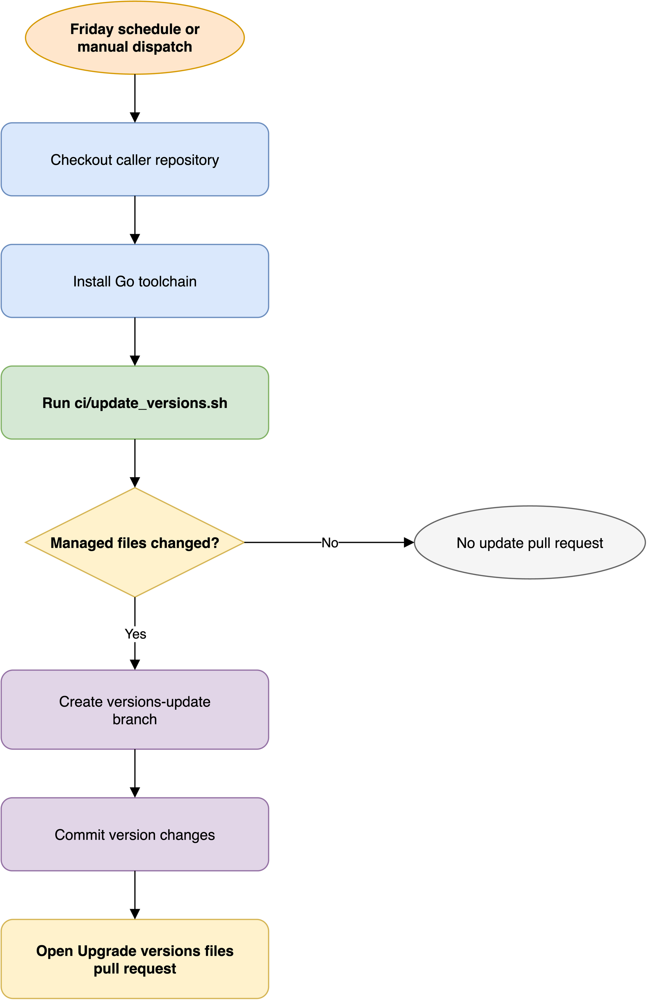

# How the update workflow works

The update workflow keeps repository-managed versions current without
making version discovery part of every consuming repository's workflow.
It runs the caller's `ci/update_versions.sh` script,
then turns any resulting changes into a pull request.

## Update flow

[Open the editable update diagram](../assets/update-workflow.drawio)

The reusable workflow supplies the execution environment and pull request
orchestration.
The caller supplies the update policy through its script.
This boundary matters because repositories do not all manage the same tools,
actions, or exceptions.

## What is managed

The reference script updates three kinds of version data:

- GitHub Action references under `.github`,
  preserving a commit SHA and a human-readable tag comment.
- Go toolchain declarations in workflow files.
- `pre-commit` hook revisions in `.pre-commit-config.yaml`.

The script can skip known exceptions and pinned actions.
Those decisions belong in the consuming repository's copy of the script,
where maintainers can document why a version must remain fixed.

## Why updates become pull requests

Version resolution uses live upstream information.
The resulting change therefore needs review for compatibility,
release notes, and repository-specific constraints.
A pull request also lets the normal linter and test checks evaluate the update
before it reaches the default branch.

The workflow does not decide whether a resolved version is safe.
It automates discovery and packaging;
maintainers remain responsible for approving the change.

## Schedule and concurrency

The default schedule runs every Friday at 00:00 Coordinated Universal Time.
Maintainers can also invoke the workflow manually.
Concurrency allows one active update run for a Git ref
and cancels an older overlapping run.
This prevents multiple scheduled runs from competing to create the same
maintenance branch.

## Credential boundary

The checkout uses the required `WORKFLOW_TOKEN` with persisted credentials.
That token lets the workflow push the update branch
and open the pull request.
The caller must grant `contents: write` and `pull-requests: write`
to the called job.

The update workflow is intentionally separate from the linter:
the update creates a proposed change,
while the linter evaluates that change in the caller's normal checks.

## Related documentation

- [Consume the update workflow](../how-to-guides/consume-update.md)
- [Update workflow reference](../references/update-workflow.md)
- [How the workflows fit together](workflows.md)
