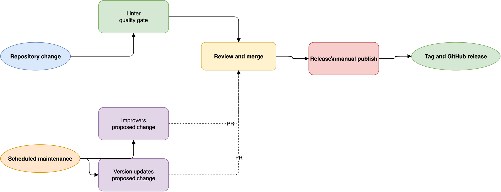

# How the workflows fit together

This project provides four reusable automation paths for a repository:

- **Lint and static checks** establish whether a change meets the repository's
  configured quality rules.
- **Code quality improvements** use scheduled agents to propose focused
  maintenance changes.
- **Version updates** refresh managed tool and action versions in a pull
  request.
- **Release** turns the repository's recent changes into a tagged GitHub
  release with generated release notes.

These workflows have different responsibilities.
The linter is a validation gate for changes already in flight.
The improvers and update workflows create proposed maintenance changes.
The release workflow publishes a deliberate repository state.

## A repository lifecycle

[Open the editable workflow lifecycle diagram](../assets/workflows.drawio)

The diagram describes the usual relationship between the workflows,
not a hard dependency graph.
Each workflow can also be invoked manually or through `workflow_call`
when its contract supports that entry point.

## Shared design principles

### Reuse the workflow, keep the repository context

A reusable workflow is defined in this repository,
but GitHub runs it against the caller's repository context.
That distinction lets one workflow definition serve many repositories
without moving their source code or configuration into this project.

The caller remains responsible for repository-specific inputs,
permissions, secrets, triggers, and configuration files.

### Make changes reviewable

Maintenance workflows do not silently merge generated changes.
The improvers workflow and the update workflow produce pull requests,
which gives maintainers a review point before automation changes the default
branch.

The linter reports failures through the workflow run and a GitHub issue.
The release workflow is different:
it has write access because its purpose is to publish a release
after a maintainer deliberately invokes it.

### Keep permission boundaries explicit

Validation needs read access to repository contents.
Maintenance workflows need write access to branches and pull requests.
Release needs write access to tags, changelog commits, and releases.
Secrets are passed only where the workflow contract requires them.

## Choosing a workflow

Use the [linter](linter-workflow.md) when a push or pull request needs
automated quality checks.
Use the [improvers workflow](how-it-works.md) when an agent should inspect
the codebase and propose a bounded maintenance improvement.
Use the [update workflow](update-workflow.md) when managed versions should be
refreshed on a schedule.
Use the [release workflow](release-workflow.md) when the reviewed repository
state should become a tagged GitHub release.

## Related documentation

- [Workflow catalog](../../.github/workflows/README.md)
- [How-to guides](../how-to-guides/index.md)
- [Workflow references](../references/index.md)
