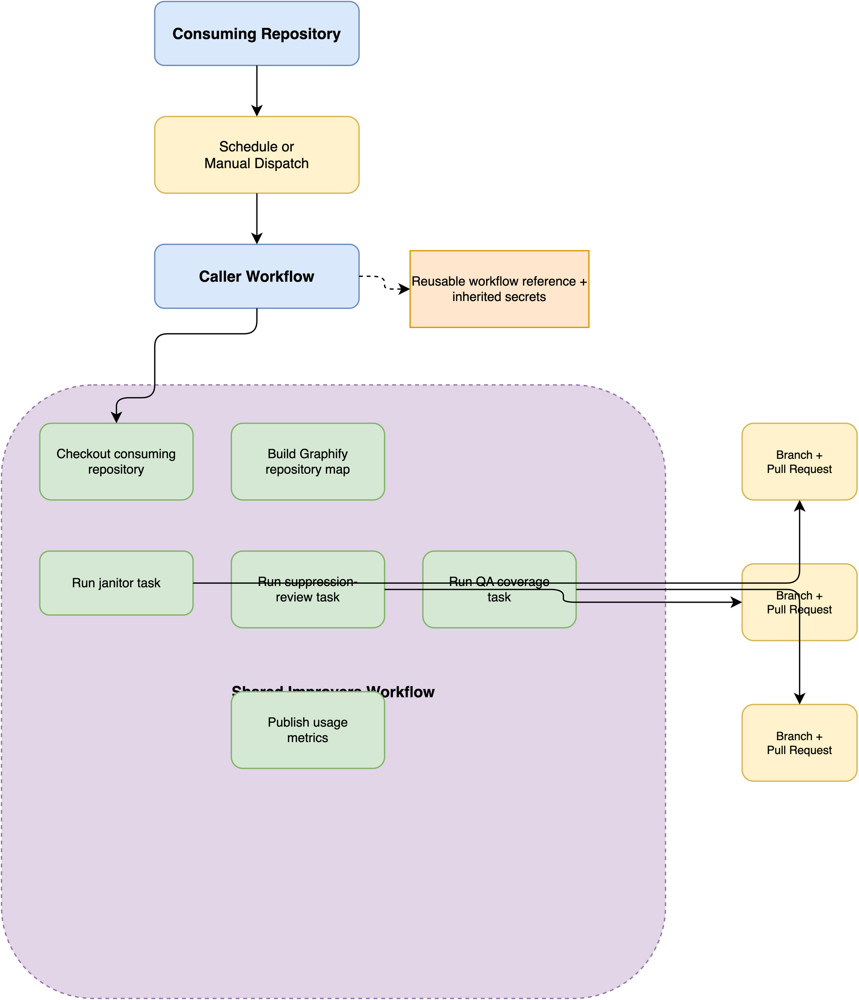

# Consume and customize the improvers workflow

Use a caller workflow when you want the upstream maintenance logic and prompts to stay centrally managed.



## Add the minimal caller

Create `.github/workflows/improvers.yml` in the consuming repository:

```yaml
name: "Maintenance: Code Base Quality Improvements"

# yamllint disable-line rule:truthy
on:
  schedule:
    - cron: "0 0 15 * *"
  workflow_dispatch:

permissions: read-all

jobs:
  improvers:
    permissions:
      contents: write
      pull-requests: write
    uses: electrocucaracha/gh-workflows/.github/workflows/improvers.yml@main
    secrets: inherit
```

The called job needs `contents: write` to push branches and `pull-requests: write` to open pull requests.
The `secrets: inherit` setting makes the caller's `COPILOT_TOKEN` available to the reusable workflow.

## Install the required agents

Keep these files in the consuming repository:

| File                                  | Used by                                    | Purpose                                                      |
| ------------------------------------- | ------------------------------------------ | ------------------------------------------------------------ |
| `.github/agents/janitor.agent.md`     | `reduce-tech-debt`, `remove-ignored-rules` | Removes dead code and complexity, and resolves suppressions. |
| `.github/agents/qa-subagent.agent.md` | `improve-code-coverage`                    | Finds coverage gaps and adds behavior-focused tests.         |

The agent names in their frontmatter must continue to resolve from the matrix values in the reusable workflow.
Copy both files again when their upstream definitions change.

## Change the schedule

Edit only the caller's `schedule` entry.
GitHub Actions cron expressions use Coordinated Universal Time (UTC).
For example,
run at 03:30 UTC every Monday:

```yaml
on:
  schedule:
    - cron: "30 3 * * 1"
  workflow_dispatch:
```

Keep `workflow_dispatch` so maintainers can run the workflow on demand.

## Pin the reusable workflow

The `@main` reference receives upstream changes immediately.
For stable and auditable runs,
replace it with a release tag or full commit SHA:

```yaml
uses: electrocucaracha/gh-workflows/.github/workflows/improvers.yml@<release-tag-or-commit-sha>
```

Review upstream changes before updating the pinned reference.

## Use an organization secret

For several repositories,
an organization owner can create an Actions secret named `COPILOT_TOKEN` and grant access only to selected repositories.
Each caller can continue to use `secrets: inherit`.

The token remains tied to the account that generated it,
including its Copilot entitlement, premium-request allowance, and expiration.
Rotate it when its owner changes role or no longer maintains the automation.

## Troubleshoot a failed run

### Copilot authentication fails

- Confirm that `COPILOT_TOKEN` exists in the consuming repository or is accessible as an organization secret.
- Confirm that the token owner has an active Copilot subscription.
- Confirm that the fine-grained token has the account-level **Copilot Requests** permission.
- Confirm that organization policy permits Copilot CLI.
- Replace expired or revoked tokens.

### The custom agent is not found

Confirm both agent files exist on the ref that started the workflow,
under `.github/agents/` with their original filenames and valid frontmatter.

### Branch creation or pull request creation fails

Check **Settings** > **Actions** > **General** > **Workflow permissions**.
Confirm that organization or repository policy permits write operations from GitHub Actions.
Also confirm that branch protection and rulesets allow the automation to create its proposed branches.

### Validation fails

Run `make test` and `make lint` locally.
The workflow assumes those targets exist and are non-interactive.
Adapt the target repository's Makefile rather than changing the centrally managed prompt for one repository.
